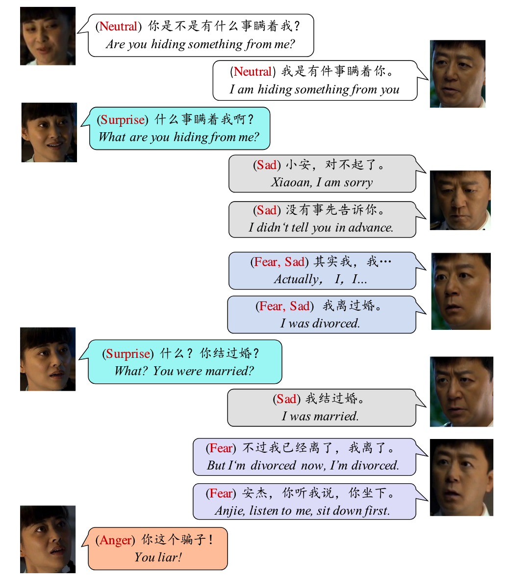

# 多模态对话中的情感识别任务（MERC_Challenge_CCAC2023）

## 背景介绍

第三届中国情感计算大会（The Third Chinese Conference on Affective Computing, CCAC 2023）将于2023年6月30日至7月2日在西安市举行，会议由西安交通大学承办。作为中国中文信息学会（国内一级学会）在情感计算领域的重要会议，CCAC聚焦于文本、语音、图像等各种模态下的情感认知和情感计算，为研讨和传播情感计算领域最新学术和技术成果提供了最广泛的高层次交流平台。

在本届大会中，我们将举办第一届多模态对话中的情感识别评测项目。多模态对话中的情感识别旨在自动识别和跟踪对话中说话者的情绪状态，在自然人机交互、教育、医疗等场景具有广泛的应用。与传统的单句多模态情感识别不同，多模态对话场景下的多模态情感识别是一个更具挑战性的问题，因为对话中影响说话者情绪状态的影响因素很多，包括多模态的上下文、对话者刺激、自身情绪惰性、对话场景、人格特征等。本届评测关注多模态对话场景下的情感识别任务，鼓励参赛者从不同模态不同角度对多模态对话中的情感进行建模和预测，旨在推动多模态对话情感识别相关研究的发展。

本届多模态对话中的情感识别评测由中国中文信息学会情感计算专委会（CIPS-CCAC）主办，中国人民大学AI·M³多媒体计算实验室、启元实验室共同承办，欢迎各界人士参与。

## 评测内容

本届多模态对话中的情感识别评测任务将采用M3ED（Multi-modal Multi-scene Multi-label Emotional Dialogue）数据集作为支撑数据集，该任务的任务描述、数据集描述以及评测描述如下。

### 任务描述

本届多模态对话中的情感识别评测任务旨在识别M3ED数据集中不同语句（utterance）的情感。输入是含有文本、语音以及图像信息的对话，输出是对话中每条语句对应的情感。在本次评测中，我们将对话中蕴含的情感分为以下七个类别之一：平静（Neutral）、开心（Happy）、惊讶（Surprised）、难过（Sad）、厌恶（Disgust）、生气（Angry）和害怕（Fear）。

说明：数据集原始标注是多情感标签标注（比如生气和伤心），为简化任务难度，本届测评采用单标签（主情感标签）情感识别。

### 数据集描述

本次技术评测使用的标注数据集为M3ED数据集，由中国人民大学AI·M³多媒体计算实验室提供，原始数据源于56部中文电视剧的 990 个情感二人对话视频片段。M3ED数据集总共包含 24,449 个话语的标注，存在丰富的情感互动。我们将发布视频片段所对应的视频信息、文本信息以及对应的标注信息，其中文本信息和标注信息将以json格式发布，数据样例如下：
<div align="center">
 
</div>

<p align="center">图1. 数据样例</p>

| 话语编号            | **开始时间** | **结束时间** | **文本**                | **说话者** | **情感** |
| ------------------- | ------------ | ------------ | ----------------------- | ---------- | -------- |
| **fumuaiqing_1_1**  | 00:00:00:03  | 00:00:01:17  | 你是不是有什么事瞒着我? | A          | 平静     |
| **fumuaiqing_1_2**  | 00:00:06:00  | 00:00:07:18  | 我是有件事瞒着你        | B          | 平静     |
| **fumuaiqing_1_3**  | 00:00:10:13  | 00:00:12:04  | 什么事瞒着我啊？        | A          | 惊讶     |
| **fumuaiqing_1_4**  | 00:00:19:11  | 00:00:20:04  | 小安                    | B          | 难过     |
| **fumuaiqing_1_5**  | 00:00:22:23  | 00:00:23:19  | 对不起了                | B          | 难过     |
| **fumuaiqing_1_6**  | 00:00:26:05  | 00:00:28:08  | 没有事先告诉你          | B          | 难过     |
| **fumuaiqing_1_7**  | 00:00:28:23  | 00:00:31:18  | 其实我我                | B          | 害怕     |
| **fumuaiqing_1_8**  | 00:00:34:17  | 00:00:35:22  | 我是离过婚的            | B          | 害怕     |
| **fumuaiqing_1_9**  | 00:00:42:07  | 00:00:45:10  | 什么？你结过婚？        | A          | 惊讶     |
| **fumuaiqing_1_10** | 00:00:47:23  | 00:00:49:18  | 我结过婚                | B          | 难过     |
| **fumuaiqing_1_11** | 00:00:52:05  | 00:00:54:18  | 不过我已经离了 我离了   | B          | 害怕     |
| **fumuaiqing_1_12** | 00:00:59:08  | 00:01:01:00  | 安杰 你听我说你坐下     | B          | 害怕     |
| **fumuaiqing_1_13** | 00:01:01:06  | 00:01:02:10  | 你这个骗子              | A          | 生气     |
 
<p align="center">表1. 数据样例标注信息</p>

### 评测描述

本次评测以Marco F1值作为评测指标。

## 报名网站

[多模态对话中的情感识别任务评测报名表](https://docs.qq.com/form/page/DQUNKTmlhY3p3TWRO)

## 注意事项

1. 本次评测使用的数据集由网络获取，仅限于本次技术评测及学术研究使用，未经许可不能作为商业用途或其他目的。
2. 训练集数据用于模型的学习，验证集和测试集用于模型的效果评测。
3. 如需使用本数据集进行课题研究及论文发表，请联系：qjin@ruc.edu.cn。
4. 仅允许使用所有参赛者均可获得的开源代码、工具以及外部数据。
5. 算法与系统的知识产权归参赛队伍所有，要求最终结果排名前5的队伍提供算法代码与系统报告（包括方法说明、数据处理、参考文献和使用开源工具等信息），供会议交流。
6. 本评测联系人：金琴（qjin@ruc.edu.cn）。

## 重要日期

时区：GMT+08:00

| 事项                 | 时间          |
| -------------------- | ------------- |
| 任务发布与报名启动   | 2023年4月10日 |
| 训练集与验证集数据发布       | 2023年5月5日  |
| 测试集数据发布       | 2023年6月7日  |
| 提交截止（报名结束） | 2023年6月10日 |
| 比赛结果公布         | 2023年6月22日 |

训练集、验证集与测试集数据均已通过报名邮箱发布，如有疑问请联系[zhangtenggan@ruc.edu.cn](mailto:zhangtenggan@ruc.edu.cn)

## 比赛结果
本次比赛共有51个队伍报名，其中16个队伍提交了比赛结果，下面是获奖队伍的信息（前五名）

| 名次 | 队伍 | 成员 | 最佳Macro-F1 |
| --- | --- | --- | --- |
| 第一名 | SUST-EiAi-TEAM | 陈海丰，李晶，张倩，郭楚佳，白义民，陈景霞 | 0.5657 |
| 第二名 | 北京邮电大学-AI4AI | 李启飞，王聪，任一鸣，王栋，高迎明，李雅 | 0.5273 |
| 第三名 | 哈工大计算学部语言技术研究中心 | 赵志龙，胥卜凡，徐冰 | 0.5038 |
| 第四名 | nustm | 郑文杰，虞剑飞，夏睿 | 0.4946 |
| 第五名 | ZUT | 李晨阳，陈紫薇，赵中杰，郭徽，张龙 | 0.4827 |

## 评测论坛安排
2023年7月1日（周六）下午15:20-16:20

15:20 – 15:25 评测总结

15:25 – 15:35 第一名技术分享

15:35 – 15:45 第二名技术分享

15:45 – 15:55 第三名技术分享

15:55 – 16:05 第四名技术分享

16:05 – 16:15 第五名技术分享

16:15 – 16:20 颁奖合影


## 评委会成员

- 主席：金琴

- 评测委员会成员：赵金明

- 顾问委员会成员：王素格、赵妍妍、杨亮

## 会务组成员

- 张腾甘（[zhangtenggan@ruc.edu.cn](mailto:zhangtenggan@ruc.edu.cn)）、张鑫洁（[zhangxinjie827@ruc.edu.cn](mailto:zhangxinjie827@ruc.edu.cn)）、黄兆培（[huangzhaopei@ruc.edu.cn](mailto:huangzhaopei@ruc.edu.cn)）、孙雷（[leisun@ruc.edu.cn](mailto:leisun@ruc.edu.cn)）

## 联系方式

 如有疑问，请致信评测会务组：[zhangtenggan@ruc.edu.cn](mailto:zhangtenggan@ruc.edu.cn) / [huangzhaopei@ruc.edu.cn](mailto:huangzhaopei@ruc.edu.cn) / [leisun@ruc.edu.cn](mailto:leisun@ruc.edu.cn)

## 参考资料与文献

```
 @misc{RUCM3ED,  
   author={AIM3-RUC},  
   abstract={M3ED: Multi-modal Multi-scene Multi-label Emotional Dialogue Database. ACL 2022}, 
   year={2022},  
   url={https://github.com/AIM3-RUC/RUCM3ED},
   note={GitHub repository}
}
```

```
@inproceedings{zhao2022m3ed,
  title={M3ED: Multi-modal Multi-scene Multi-label Emotional Dialogue Database},
  author={Zhao, Jinming and Zhang, Tenggan and Hu, Jingwen and Liu, Yuchen and Jin, Qin and Wang, Xinchao and Li, Haizhou},
  booktitle={Proceedings of the 60th Annual Meeting of the Association for Computational Linguistics (Volume 1: Long Papers)},
  pages={5699--5710},
  year={2022}
}
```

## 致谢

- 主办方：中国中文信息学会情感计算专委会（筹）（CIPS-CCAC）

- 承办方：中国人民大学、启元实验室
